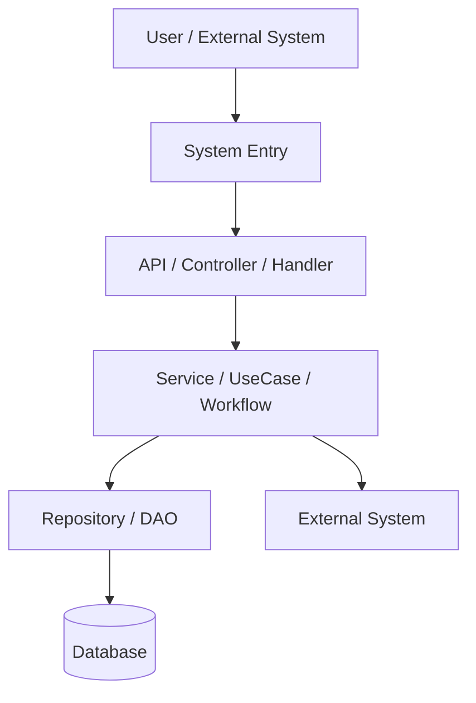
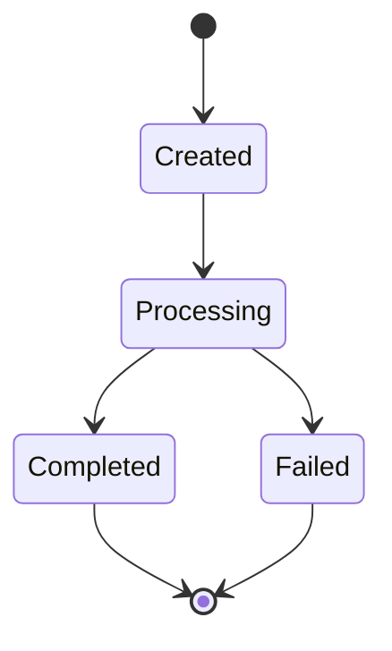
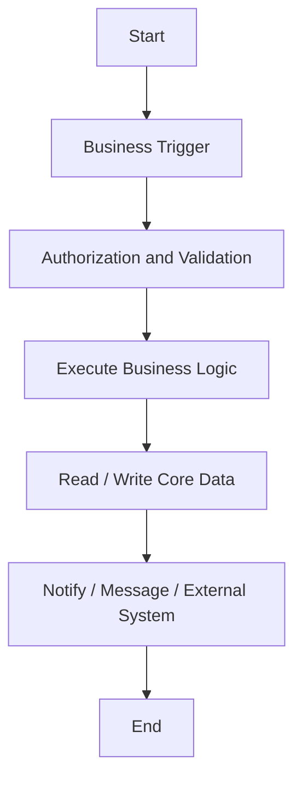
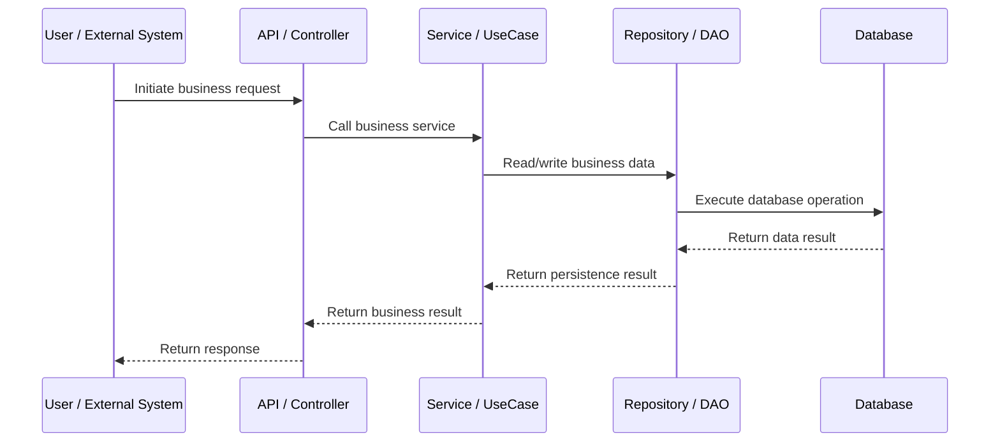
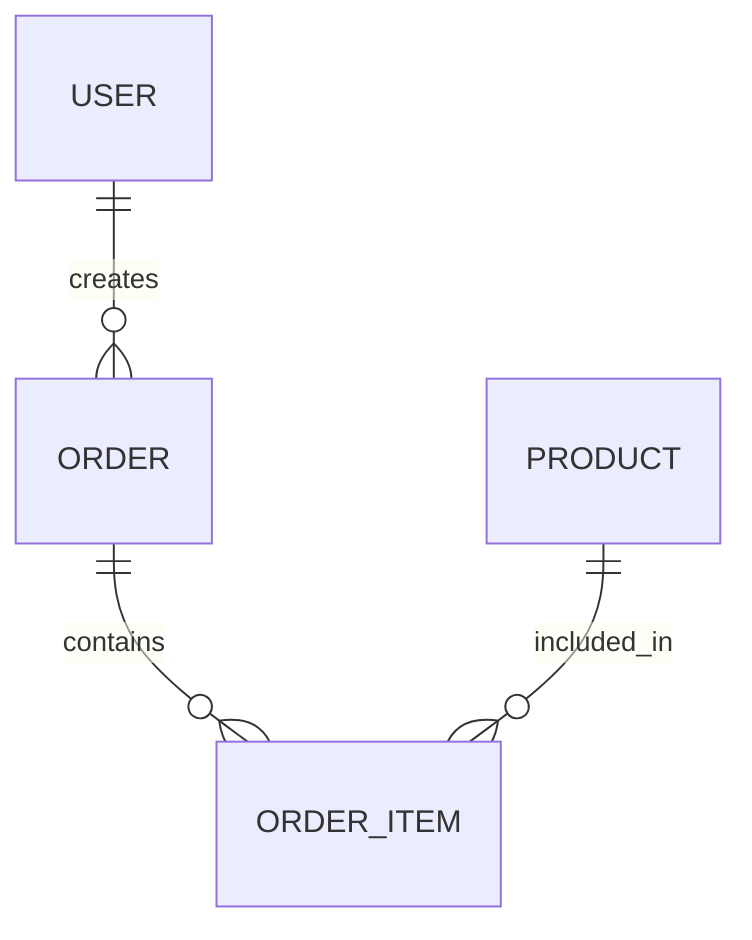
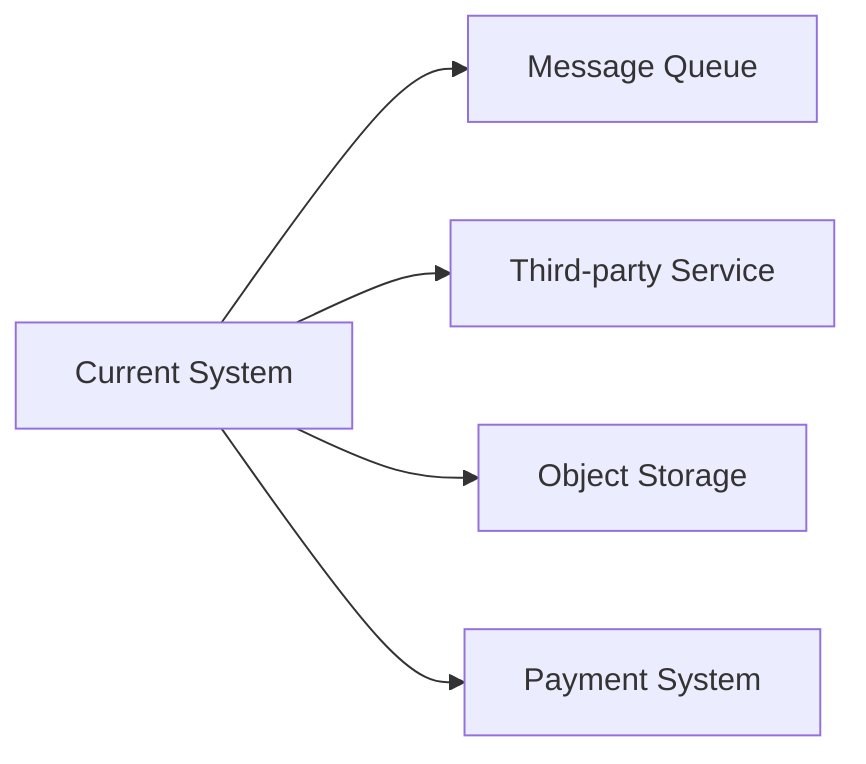

# Business Flow Document Template

Use this structure for `docs/business-flow.md`. Adapt section names to the user's requested language, but keep the coverage.

```markdown
# Business Flow Documentation

## 1. Document notes

### 1.1 Project name
### 1.2 Analysis scope
### 1.3 Analysis method
### 1.4 Evidence convention
### 1.5 Uncertainty convention

## 2. Project overview

### 2.1 Technology stack
### 2.2 System architecture



### 2.3 Core modules

| Module | Responsibility | Code location |
|---|---|---|

## 3. Business domain model

### 3.1 Glossary

| Term | Meaning | Evidence |
|---|---|---|

### 3.2 Core business entities

| Entity | Meaning | Evidence |
|---|---|---|

### 3.3 Roles

| Role | Description | Evidence |
|---|---|---|

### 3.4 State transitions



## 4. Core business flow overview

### 4.1 Flow list

| Flow | Business goal | Trigger | Core modules |
|---|---|---|---|

### 4.2 Overall business process



## 5. Detailed business flows

### 5.1 Flow: [name]

#### 5.1.1 Business goal
#### 5.1.2 Trigger

- UI entry:
- API entry:
- Scheduled job entry:
- Message entry:

#### 5.1.3 Participating modules

| Module | File | Role |
|---|---|---|

#### 5.1.4 Execution steps

1. ...

#### 5.1.5 Call sequence



#### 5.1.6 Data changes

| Stage | Data object | Change | Evidence |
|---|---|---|---|

#### 5.1.7 State changes

| From | To | Trigger | Evidence |
|---|---|---|---|

#### 5.1.8 Branches and exceptions

| Scenario | Handling | Code location |
|---|---|---|

#### 5.1.9 Code evidence

- `path/to/file`
  - `ClassName.methodName`
  - Notes: ...

## 6. API and business action mapping

| API / Entry | Method | Business action | Core handler | Notes |
|---|---|---|---|---|

## 7. Data model and business relationships

### 7.1 Core data models

| Table / Model | Business meaning | Evidence |
|---|---|---|

### 7.2 Entity relationship diagram



## 8. External systems and integrations



| External system | Purpose | Call timing | Evidence |
|---|---|---|---|

## 9. Permissions, validation, and security

### 9.1 Authentication
### 9.2 Authorization
### 9.3 Input validation
### 9.4 Business rule validation
### 9.5 Sensitive operations and audit logs

## 10. Scheduled jobs, async jobs, and messaging

| Task / Message | Trigger | Handling logic | Data impact | Evidence |
|---|---|---|---|---|

## 11. Business rules inferred from tests

| Test file | Business rule verified | Related flow |
|---|---|---|

## 12. Uncertainties and confirmation questions

| Question | Reason | Suggested owner |
|---|---|---|

## 13. Appendix: key code index

| Business point | File | Function / Class | Notes |
|---|---|---|---|
```
