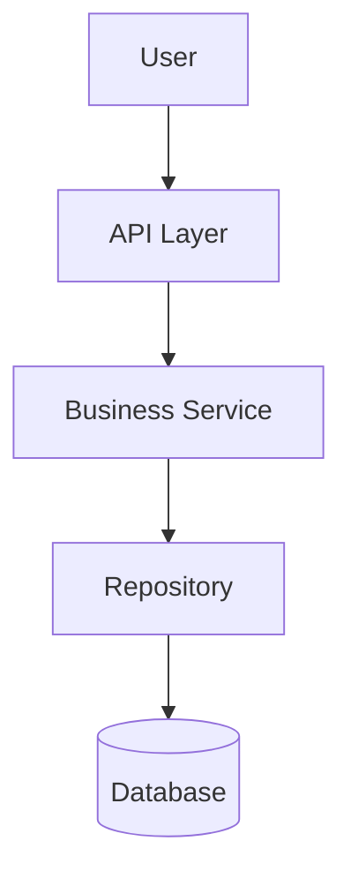
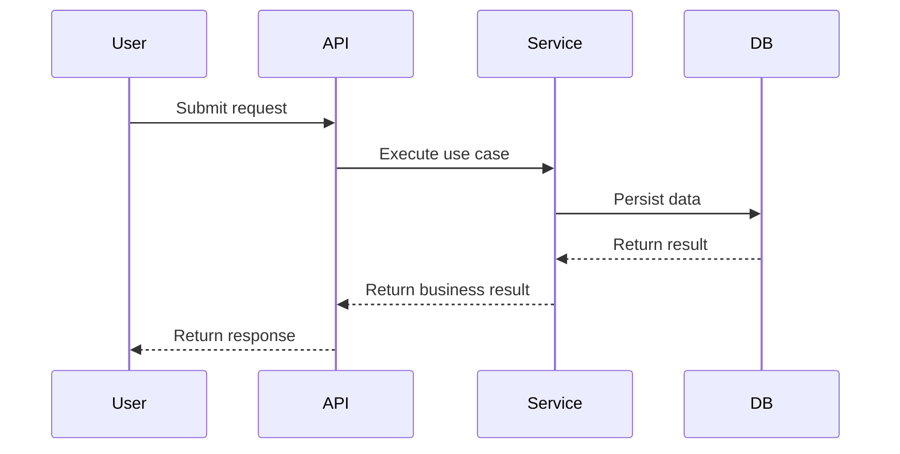
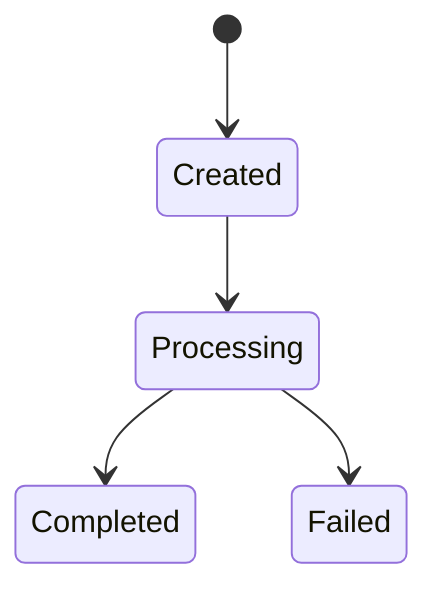
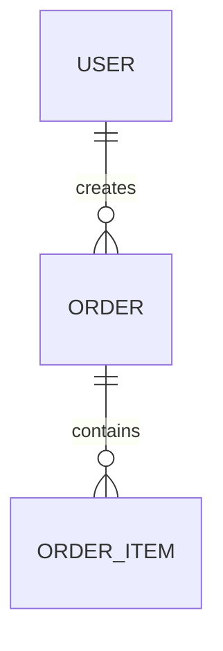

# Mermaid Guidelines

Use Mermaid diagrams in `docs/business-flow.md` only when backed by evidence.

## Required diagram families

Try to include these when applicable:

1. Architecture: `flowchart TD`
2. Core process overview: `flowchart TD`
3. Key flow sequence: `sequenceDiagram`
4. State transition: `stateDiagram-v2`
5. Data relationship: `erDiagram`
6. External integration: `flowchart LR`

## Syntax rules

- Always use fenced Markdown code blocks tagged as `mermaid`.
- Use business-language node names, not only function names.
- Avoid special characters that commonly break Mermaid node parsing.
- Prefer short node labels.
- Split large diagrams into multiple smaller diagrams.
- Do not place Markdown tables inside Mermaid blocks.
- For labels with punctuation, prefer simple text or quoted labels where supported.
- Validate mentally that each edge has valid node identifiers.

## Safe examples

Architecture:

Sequence:

State:

Entity relationship:

